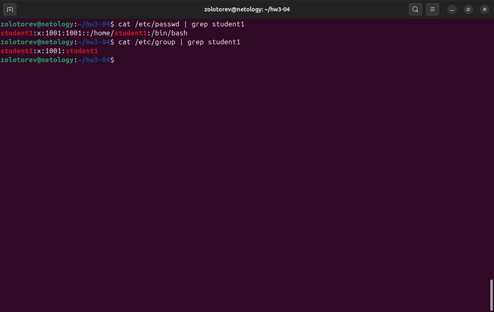
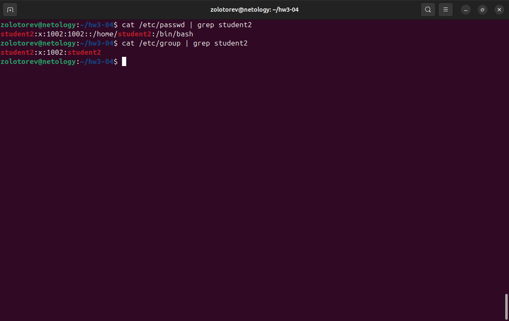
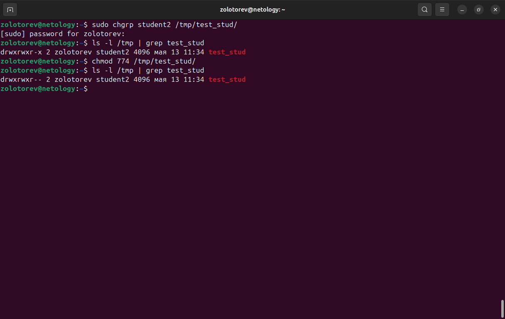
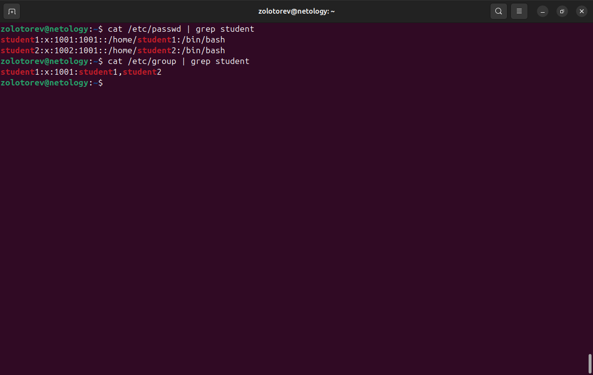

# Домашнее задание к занятию «Управление пользователями»
### Золоторев Н.Д.

### Задание 1

   1. Cоздайте пользователя student1 с оболочкой bash, входящего в группу student1.

   2. Создайте пользователя student2, входящего в группу student2.

Приведите своё решение в виде снимков экрана.

### Решение 1

### Задание 2

Создайте в общем каталоге (например, /tmp) директорию и назначьте для неё полный доступ со стороны группы student2 и доступ на чтение всем остальным.

Приведите своё решение в виде снимков экрана.

### Решение 2

### Задание 3

Какой режим доступа установлен для файлов /etc/passwd и /etc/shadow?

Объясните, зачем понадобилось именно два файла.

Приведите ответ в свободной форме.

### Решение 3

1. /etc/passwd: Обычно имеет права -rw-r--r-- (644), что означает, что владелец может читать и записывать файл, а группа и остальные пользователи могут только читать его. Этот файл доступен для всех пользователей системы.
   /etc/shadow: Обычно имеет права -rw------- (600), что означает, что только владелец (обычно пользователь root) может читать и записывать файл, а остальные пользователи не имеют доступа. Это обеспечивает безопасность паролей.

2. /etc/passwd cодержит основную информацию о пользователях, такую как имя пользователя, UID (идентификатор пользователя), GID (идентификатор группы), домашний каталог и оболочку. Доступен для всех, чтобы другие программы и пользователи могли получать информацию о пользователях.

   /etc/shadow содержит зашифрованные пароли пользователей и другую информацию, связанную с безопасностью, такую как дата последнего изменения пароля и срок действия. Доступен только для администратора (root), чтобы защитить пароли от несанкционированного доступа.

Разделение информации на два файла позволяет обеспечить безопасность паролей, сохраняя при этом доступность основной информации о пользователях. Это помогает предотвратить утечку паролей и защищает систему от несанкционированного доступа.

### Задание 4

Удалите группу student2, а пользователя student2 добавьте в группу student1.

Приведите своё решение в виде снимков экрана.

### Решение 4

### Задание 5

Напишите своими словами, как происходит сложение и вычитание прав доступа к файлам и папкам.

Приведите ответ в свободной форме.

### Решение 5

Права можно задавать в числовом формате. В этом случае каждое право имеет своё значение: 4 — разрешение на чтение, 2 — разрешение на запись, 1 — разрешение на выполнение, 0 — отсутствие разрешения. Суммируя эти значения, можно установить нужные права. 
К примеру если выполнить команду:

chmod 740 test.txt

Это будет означать, что владелец будет иметь полные права доступа (чтение, запись и выполнение). Группа будет иметь права только на чтение. А остальные пользователи не будут иметь никаких прав доступа к файлу.
